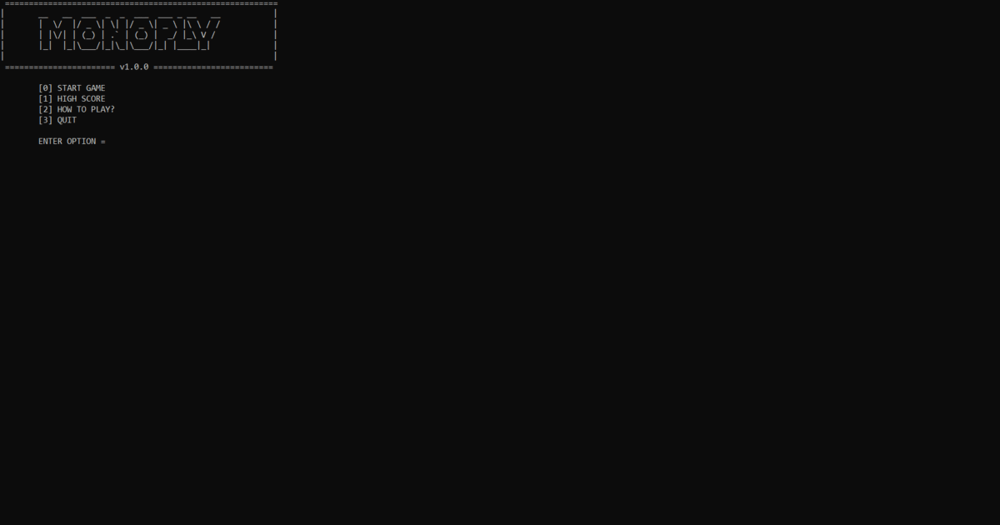

# Monopoly Board Game - C++
This is an implementation of the board game Monopoly using C++ CLI edition.

# Main Features 🏆 
● Multi-Player  
● Building houses and hotels  
● Chance and community cards  
● High Scrore (File Handling)  
● Seperate Purchasing Menu  

# User Interface 💻

# Credit ✍️
This is a project from CL-1002: Engineering course of FAST University instructed by Aliza Saeed.

